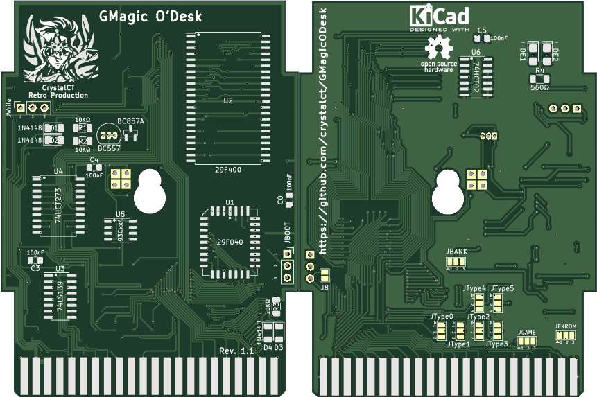

# GMagic O'Desk

Open Hardware design of a 512Kbyte C64 multipurpose type cartridge compatible with the following types:
* Ocean 128/256/512
* Magic Desk (Magic Desk, Domark, HES Australia) up to 512Kbyte
* Gmod2
* System3
* C64GS
* Dinamic

Due to the similarity of the listed cartridge types, it was possible to create a single PCB which, with the appropriate configurations, will work perfectly as a basis for the creation of cartridges containing games developed for those cartridge types. 
Furthermore, my secondary objective was the reuse of many SMD chips at my disposal and therefore this project differs from other similar projects mainly due to the use of SMD technology, making it more complex regarding the soldering work. 
If you want to acquire a simpler PCB I recommend the [c64-uni-cart](https://github.com/msolajic/c64-uni-cart) by Marko Šolajić (Ocean/Magic Desk) and [GMod2](https://www.freepascal.org/~daniel/gmod2/) by Daniel Mantione (GMod2/Ocean/Magic Desk).

Bank Selection
--------------
The types of cartridge listed above can be divided into two types: "data" type bank selection and "address" type bank selection. 
* "Data" bank selection: Ocean, Magic Desk and GMod2. Bank switching is done by writing X to $DE00, where X is the bank number.
* "Address" bank selection: System3, CG64GS and Dinamic. Bank switching is done by accessing address $DE00+X, where X is the bank number.

To correctly map the memory inside the FLASH an 8-bit latch (74LS273) is used and the decoding of the PHI2 and I/O1 signals with a Dual 2-Line To 4-Line Decoders/Demultiplexer (74LS139) for the "data" banking and a NOR gates (74LS02) for "address" banking.

Schematics
----------

Appearance
----------

Cartrdige Types
---------------
*Ocean*

